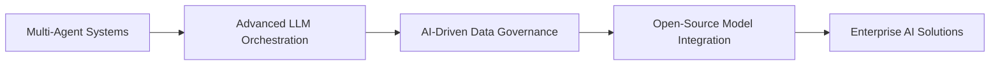

<div align="center">
  
# Hi there, I'm Divya Pratap Singh Bhadoria! 👋

<p>
  
</p>

**🏢 Data Engineering, Management & Governance Analyst at Accenture**  
**📍 Gwalior, India | 🎯 Specializing in AI-Powered Solutions**

[](https://thirtynimrod.github.io)
[](https://www.linkedin.com/in/iamdivyapratap/)
[](mailto:thirtynimrod@outlook.com)

</div>

---

## 🚀 About Me

```python
class DivyaPratap:
    def __init__(self):
        self.role = "Data Engineering, Management & Governance Analyst"
        self.company = "Accenture"
        self.location = "Gwalior, India"
        self.specialties = [
            "AI Agent Development",
            "Testing Automation", 
            "Data Engineering",
            "Generative AI Solutions"
        ]
        self.current_focus = "Multi-agent AI systems & LLM orchestration"
        self.hobbies = ["Gaming 🎮", "Music 🎵", "AI Research 🤖"]
    
    def get_achievements(self):
        return {
            "Star of the Month": "February 2025",
            "Recognition": "Data & AI Capability Excellence",
            "Passion": "Transforming complex data into intelligent solutions"
        }
```

I'm a passionate technologist who thrives at the intersection of **Data Engineering** and **Artificial Intelligence**. At Accenture's Data & AI Capability, I specialize in building cutting-edge **AI-powered solutions** and **automated testing frameworks** that transform complex enterprise challenges into elegant, efficient systems.

My journey involves pushing the boundaries of **generative AI technologies**, developing sophisticated **AI agents**, and creating robust **data governance frameworks** that drive real-world impact. There's nothing more rewarding than seeing these solutions come to life in enterprise environments!

**🏆 Recently recognized as "Star of the Month" (February 2025)** for exceptional contributions to Accenture's Data and AI initiatives.

> *"Once the work laptop closes, I transform into a full-time gaming strategist and music curator! 🎮🎵"*

## 🛠️ Technology Arsenal

<div align="center">

### Languages & Core Technologies


### AI/ML & Generative AI


### Data Governance & Tools


</div>

<details>
<summary><b>🔍 Detailed Technology Breakdown</b></summary>
<br>

| **Domain** | **Technologies** | **Proficiency** |
|------------|------------------|-----------------|
| **AI/ML Frameworks** | LangChain, LangGraph, Autogen, Ollama | ⭐⭐⭐⭐⭐ |
| **Programming Languages** | Python, Java, JavaScript | ⭐⭐⭐⭐⭐ |
| **Data Governance** | Collibra, Alation, Data Quality Management | ⭐⭐⭐⭐⭐ |
| **Web Development** | Streamlit, Full-Stack Development, REST APIs | ⭐⭐⭐⭐ |
| **Testing & Automation** | Selenium, Automated Testing Frameworks | ⭐⭐⭐⭐ |
| **Database Technologies** | SQL, Data Modeling, ETL Processes | ⭐⭐⭐⭐ |
| **Cloud & DevOps** | CI/CD, Version Control, Agile Methodologies | ⭐⭐⭐⭐ |

</details>

---

## 🌱 Current Learning & Exploration

<div align="center">



</div>

- 🔬 **Advanced LLM Orchestration** - Building sophisticated multi-agent conversation systems
- 📊 **AI-Driven Data Governance** - Enhancing frameworks with intelligent insights and automation  
- 🤖 **Open-Source Model Exploration** - Evaluating cutting-edge models for enterprise data processing
- 🚀 **Next-Gen Testing Automation** - Developing AI-powered testing frameworks

---

## 📊 GitHub Analytics

<div align="center">


</div>

<div align="center">


</div>

---

## 🎮🎵 Digital Playgrounds

<div align="center">

### 🎮 Gaming Universe
[](https://steamcommunity.com/id/thirtynimrod/)

### 🎵 Musical Journey  
[](https://spotify-github-profile.kittinanx.com/api/view?uid=iamdivyapratap&redirect=true)

</div>

> *"Code by day, game by night, music always! 🎯"*  
> My digital sanctuaries where creativity meets strategy and melodies fuel innovation.

---

## 🌐 Connect & Collaborate

<div align="center">

### Let's Build Something Amazing Together

[](https://www.linkedin.com/in/iamdivyapratap/)
[](mailto:thirtynimrod@outlook.com)
[](https://thirtynimrod.github.io)

</div>

**🤝 Always excited to discuss:**
- AI/ML innovations and breakthrough technologies
- Data engineering challenges and elegant solutions  
- Gaming strategies and epic adventures
- Music recommendations and hidden gems
- Collaborative projects and open-source contributions

---

<div align="center">

### ⚡ Fun Facts About Me

```python
fun_facts = {
    "🎯": "Can debug code while gaming simultaneously",
    "🎵": "Playlist changes based on coding complexity",
    "🤖": "Dreams in Python and wakes up thinking in SQL",
    "🎮": "Believes the best algorithms come from gaming logic",
    "☕": "Coffee == Code.compile() // Essential for execution"
}
```

---

**💡 "Transforming data into intelligence, one algorithm at a time!"**


</div>
